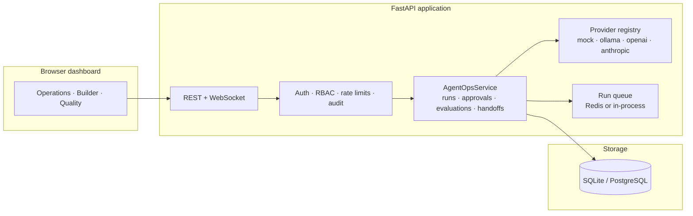
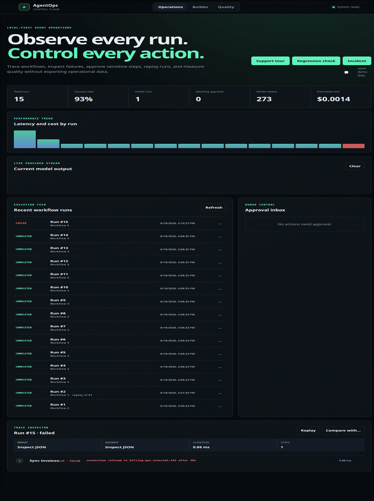

# AgentOps Control Plane

A local-first control plane for building, running, approving, evaluating, and observing
AI-agent workflows — a flight recorder and release gate for inspectable agent operations.
This repository is a portfolio proof of concept: it runs entirely on your machine and
does not require a paid hosting account.

## Architecture



## Capability matrix

| Capability | Surface |
|---|---|
| Workflow studio with immutable versions and templates | Dashboard |
| Run execution: sync/queued, retries, cancellation, crash recovery | Dashboard + API |
| Step traces, JSON inspection, replay, run comparison | Dashboard |
| Handoffs, agent trees, project memory, loop detection | Dashboard + API |
| Provider adapters: mock, Ollama, OpenAI, Anthropic | API + workflow config |
| Live streamed model output | Dashboard |
| Approvals with expiry | Dashboard; escalation is API-only |
| Evaluations: datasets, 5 matchers, release gates, case-level diffs | Dashboard |
| Schedules | API |
| Webhooks with delivery records | API |
| Alerts | API |
| Notifications (Slack, email) | Env-configured |
| Project import/export (versioned package) | API |
| Encrypted secrets vault | API |
| Authentication, roles, audit log, trace redaction | Dashboard + API |
| OTLP-shaped trace export | Experimental |
| S3-compatible backups (checksummed; not client-side encrypted) | Script / Docker backup mode |

## Quick portfolio demo

The fastest way to review the complete application is Docker Compose:

```bash
docker compose up --build agentops
```

Open <http://127.0.0.1:8110>. The dashboard offers three one-click offline
scenarios (all run on the deterministic `mock` provider — no API key, no
network, no Ollama download):



- **Support tour** — a streamed LLM draft pauses at a human approval, resumes
  on approval, hands off to a QA child workflow, and writes to project memory.
  Watch the live provider stream type out the draft.
- **Regression check** — a 6-case dataset evaluated against two immutable
  workflow versions: v1 fails 2 cases, v2 fixes them. Open Quality > select the
  two evaluations > Compare to see the case-level diff (2 fixed, 0 regressed).
- **Incident** — a billing-sync run that fails after retries with a triggered
  failure-rate alert and a failed run in the feed.

Each scenario is idempotent (seeding again returns the existing demo); tick
**reset demo data** to delete and rebuild it. The demo uses SQLite, keeps its
data in the local `agentops-data` Docker volume, and runs queued work in the
application process. No PostgreSQL, Redis, cloud account, or model-provider key
is required.

## Local development

Requires Python 3.11+ and [`uv`](https://docs.astral.sh/uv/).

```bash
uv sync
uv run uvicorn src.agentops.main:app --reload --port 8110
```

Open <http://127.0.0.1:8110>. Interactive API docs are at <http://127.0.0.1:8110/docs>.

The default database is `data/agentops.db`. Set either `AGENTOPS_DATABASE` or `DATABASE_URL` to use another SQLite path or PostgreSQL URL.

## Security configuration

Local mode is intentionally frictionless. Authentication activates when `AGENTOPS_API_KEY` is set or a user has been created.

```bash
AGENTOPS_API_KEY='use-a-long-random-token' \
AGENTOPS_ENCRYPTION_KEY='use-an-independent-long-random-secret' \
uv run uvicorn src.agentops.main:app --port 8110
```

Provider keys are read from `OPENAI_API_KEY` and `ANTHROPIC_API_KEY`. Ollama defaults to `http://127.0.0.1:11434` and can be changed with `OLLAMA_HOST`. Set `AGENTOPS_OTLP_ENDPOINT` to export completed and failed traces as OTLP-shaped JSON. Set `AGENTOPS_DEMO_ENABLED=0` to disable the demo scenarios on an exposed instance.

## Containers

The default personal-use configuration is the same one used by the quick demo:

```bash
docker compose up --build agentops
```

An optional PostgreSQL profile is available for demonstrating the portable database
layer:

```bash
docker compose --profile postgres up --build agentops-postgres
```

The SQLite service listens on port 8110; the PostgreSQL-backed service listens on 8111.
Neither configuration depends on a particular hosting provider.

## Workflow tools

`input`, `template`, `uppercase`, `lowercase`, `json_extract`, `llm`, `memory_read`, `memory_write`, `handoff`, `approval`, and `fail`.

Every step configuration may include `retries`, `retry_delay_seconds`, `timeout_seconds`, and `allowed_roles`. LLM steps also accept provider, model, system, prompt, and optional per-1K-token cost rates. Approval steps accept a prompt and `expires_in_seconds`.

A built-in deterministic `mock` provider (model `mock-small`) generates byte-identical
offline output with no key and no network — useful for demos, tests, and CI. It
streams with paced chunks (`AGENTOPS_MOCK_CHUNK_MS`, default 35), honors a fixed
latency (`AGENTOPS_MOCK_LATENCY_MS`), and loads pinned responses from
`AGENTOPS_MOCK_SCRIPT_DIR` (default `examples/mock_responses/`) so a scenario can
guarantee exact output. See `examples/mock_responses/README.md` for the pinning
workflow.

## Limitations

Honest scope for the current proof of concept:

- **Single-process operations.** The scheduler and worker run in the application
  process by default. Separated `web`/`worker`/`scheduler` modes exist, but
  multi-replica deployments need Redis for the queue and PostgreSQL for storage.
- **Per-process rate limits.** The 240 requests/min limit is in-memory per process;
  it resets on restart and is not shared across replicas.
- **Scheduling is interval-only.** No cron expressions or timezone handling; a
  process that is down does not backfill missed firings.
- **Cost accounting.** Token counts and costs are character-based estimates for
  every provider today (the mock provider's test fixtures report exact counts).
  Propagating provider-reported usage into spans is on the roadmap; the
  dashboard labels the figure "Estimated cost."
- **OTLP export is OTLP-shaped JSON**, not a protobuf OTLP/HTTP exporter. It is
  meant for simple collectors and is labeled Experimental in the matrix.
- **Webhook and notification delivery is queued** in an outbox with retry/backoff
  (up to 6 attempts, then dead-lettered with the last error). Delivery is HMAC-signed
  (`X-AgentOps-Signature`) when `AGENTOPS_WEBHOOK_SECRET` is set and rejects
  private/internal target addresses (SSRF guard).
- **S3-compatible backups are not client-side encrypted.** The backup script
  uploads with checksum metadata only; use an encrypted bucket or an encrypted
  volume and back up the encryption key separately (see
  [Backup and recovery](docs/BACKUP_AND_RECOVERY.md)). Client-side encryption is
  on the roadmap.
- **`llm_judge` needs a judge provider.** The default is the offline `mock`
  provider (deterministic; pin responses for exact verdicts). Real judges need
  a configured provider key.
- **Secrets are encrypted at rest** but workflows cannot yet reference them from
  steps; provider keys are environment variables. Wiring stored secrets into LLM
  steps is on the roadmap.

## Quality checks

```bash
uv run ruff check .
uv run pytest --cov=src.agentops --cov-report=term-missing
node --check src/agentops/static/app.js
```

See [Architecture](docs/ARCHITECTURE.md), [Deployment](docs/DEPLOYMENT.md),
[Next steps](docs/NEXT_STEPS.md), and [Threat Model](docs/THREAT_MODEL.md).

If you later expose the application outside a trusted machine, follow the network-exposed
guidance in [Deployment](docs/DEPLOYMENT.md), [Threat Model](docs/THREAT_MODEL.md), and
[Backup and recovery](docs/BACKUP_AND_RECOVERY.md).

The default `AGENTOPS_PROCESS_MODE=all` keeps the web app, worker, and scheduler in one
process for personal use. The `web`, `worker`, and `scheduler` modes remain available for
future multi-service deployments.

## License

MIT
